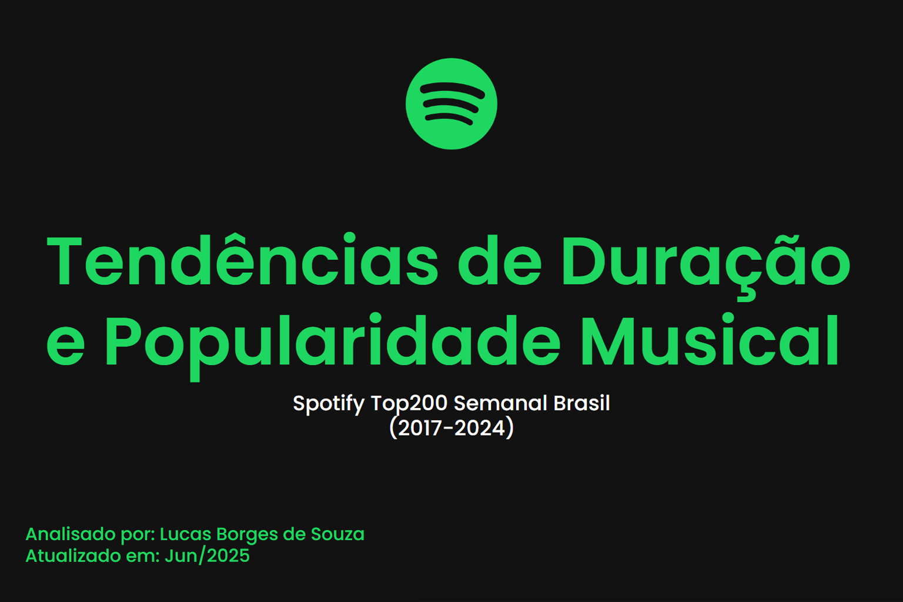

# Análise de Dados - Tendências de Duração e Popularidade no Spotify Brasil (2017–2024)

Este projeto analisa os padrões de popularidade e duração de faixas nas paradas do Spotify Brasil entre 2017 e 2024, com foco em como o mercado fonográfico e o comportamento de consumo têm evoluído.

## Objetivos

- Investigar a relação entre duração da faixa e desempenho nos charts
- Analisar o impacto de colaborações, gêneros e artistas em alta
- Verificar o papel das redes sociais e mudanças de consumo na duração das faixas ao longo do tempo

## Tecnologias Utilizadas

- Python (Pandas, Matplotlib, Seaborn)
- Jupyter Notebook
- Spotify API
- Selenium & Playwright (para scraping automatizado)

## Relatórios e Apresentação

- 📑 [Relatório PDF](docs/relatorio_tendencias_spotify.pdf)
- 🎥 [Apresentação de slides](docs/apresentacao_tendencias_spotify.pdf)

## ▶️ Como Usar

1. Clone o repositório:
   ```bash
   git clone https://github.com/seu-usuario/seu-projeto.git
   cd seu-projeto
   ```

2. Instale as dependências:
   ```bash
   pip install -r requirements.txt
   ```

3. Navegue até a pasta `/notebooks` para explorar as análises.

## 📁 Estrutura do Projeto

```bash
.
├── data/             # Dados brutos e tratados
│   ├── raw/
│   └── processed/
├── notebooks/        # Jupyter Notebooks com análises
├── scripts/          # Scripts auxiliares e funções
├── outputs/          # Gráficos, tabelas e resultados exportados
├── docs/             # Relatório final e apresentação
└── README.md         # Este arquivo
```

## 👤 Autor

**Lucas Borges de Souza**  
Analista de Dados • Publicitário • Músico

[LinkedIn](https://www.linkedin.com/in/808luke/)
